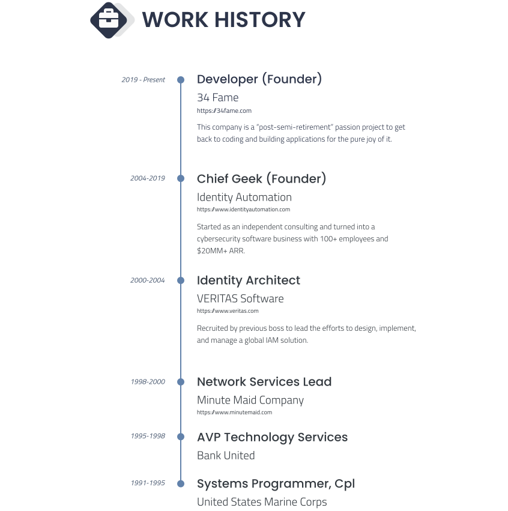

---

## Key Successes

### 34 Fame
- Developed an equipment rental management system for business customer to track locations of equipment and drivers in real-time.  Backend deployed as serverless cloud function.  Client interfaces include Web SPA and native iOS.
- Developed a web, consumer facing medical management system to help users manage their complex medical lives.  Currently has over 100 subscribers.
- Developed a web & mobile, consumer facing educational banking application for families.  Parents manage accounts for their children and children to use the app to manage income and expenses.  Currently has over 340 subscribers.

### Identity Automation
- Designed all aspects of the companies core application, RapidIdentity.  This product provides customers with a complete identity management service: identity lifecycle management, delegated administration, single sign-on, federation, multi-factor authentication, access management, and identity governance.  With over 600 customers across the globe, RapidIdentity has proven to be standard for identity management solutions.
- Architected, built and sold the largest identity management system that has ever been implemented.  The service performs many functions including identity lifecycle management, federated identity management, and application portal, for school districts and charter schools for an entire state.  The service, built on AWS, handles over 200k provisioning events and 3M login events on a daily basis.  The service has had one outage that resulted in ~20 minutes of downtime in the span of 10 years.
- Architected and led efforts to transform the product platform through its three phases:  on-premise, cloud-hosted, identity-as-a-service.  Initially, the RapidIdentity products were only available as on-premise, bare-metal or virtualized appliciances.  With the rapid improvements of cloud services, the product evolved to run natively in the AWS ecosystem and taking advantage of every service applicable.  Moving to a SaaS solution was a very cautious path as there was weekly news of hacks and breaches.  Using the latest cloud services and a certified security design, the move was made and within months was hosting a quarter of all customers.

### Minute Maid Company
- Recruited by previous executive manager.  Hired to migrate old Novell system to Microsoft (pre-Active Directory).  Convinced management to upgrade the Novell system to its latest release.  This saved over $100K in consulting fees alone.  The final implementation ended up changing the direction for The Coca-Cola Company as well.

### VERITAS Software
- Recruited by previous executive manager.  Designed and built the first full-featured, commercial implementation of IDM/IAM in the US.  This was the first project to bring together business processes between IT, HR, and core business departments.  The automation of granting and revoking access based on events in the HRMS was groundbreaking at the time.

### Bank United
- Immediately after leaving the Marine Corps, was hired as contractor to perform server maintenance.  Eventually led the project of replacing mainframe terminals at bank branches with modern PC/Server system.  Within three years become the youngest AVP in bank history with the responsibilities of managing all customer facing IT services.

### United States Marine Corps
- Developed numerous business systems for different units using COBOL, Visual Basic, Lotus Notes, and Ada.  At the ripe age of 19 was tasked with developing the application that would become the legal tracking system used across the entire Marine Corps.

---

## Find Me

  
  
  
  

---

## Technology Skills

  
  

  

  

  

  

  

  

  

  

  

  

  

  

  

  

  

  

  

  

  

  

  

  

  

  

  

  

  

---

## Personal Interests
- :notes: Music (former musician)
- :man_teacher: Teaching and mentoring
- :technologist: Coding fun projects
- :video_game: Gaming with kids
- :world_map: Traveling
- :baseball: :football: :tennis: Sports